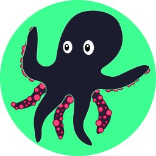
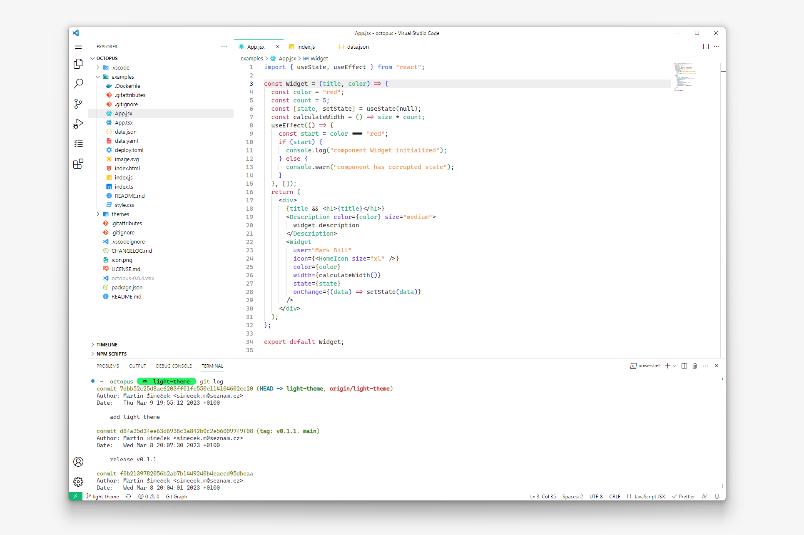
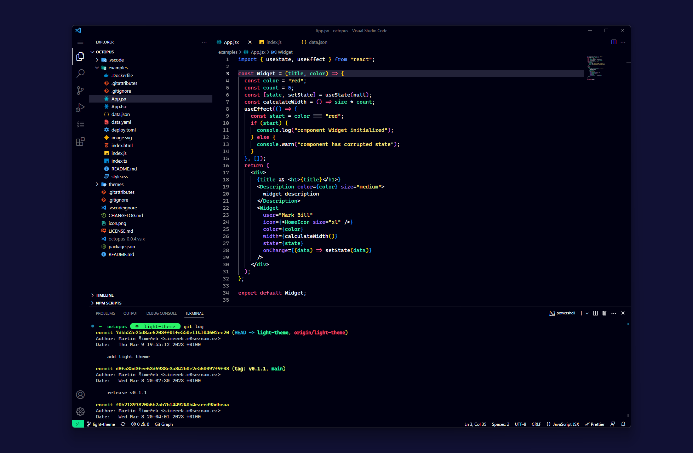

# Octopus

VS Code theme extension containing two color theme variants, [Coral Reef (light)](#coral-reef)
and [Deep Ocean (dark)](#deep-ocean).

## Coral Reef

Simple light theme for daytime use.

## Deep Ocean

Dark theme with deep blue background for night owls.

## Supported syntax:

This theme has been created and tested for use with these file formats:

### HTML

<!--- TODO: add HTML screenshot --->

### CSS

<!--- TODO: add CSS screenshot --->

### JS

<!--- TODO: add JS screenshot --->

### JSX

<!--- TODO: add JSX screenshot --->

### TS

<!--- TODO: add TS screenshot --->

### TSX

<!--- TODO: add TSX screenshot --->

### JSON

<!--- TODO: add JSON screenshot --->

### YAML

<!--- TODO: add YAML screenshot --->

### TOML

<!--- TODO: add TOML screenshot --->

### SVG

<!--- TODO: add SVG screenshot --->

### .env

<!--- TODO: add .env screenshot --->

### dockerfile

<!--- TODO: add dockerfile screenshot --->

### markdown

<!--- TODO: add .md screenshot --->

## Customization 🎨

You can always [Customize this color theme](https://code.visualstudio.com/docs/getstarted/themes#_customizing-a-color-theme) if you are missing syntax support for your favourite language or want to tweak some colors a bit.

### Dev Tools

[Scope inspector](https://code.visualstudio.com/api/language-extensions/syntax-highlight-guide#scope-inspector) and [VS Code colors documentation](https://code.visualstudio.com/api/references/theme-color) are really useful resources for color tuning. 👌
